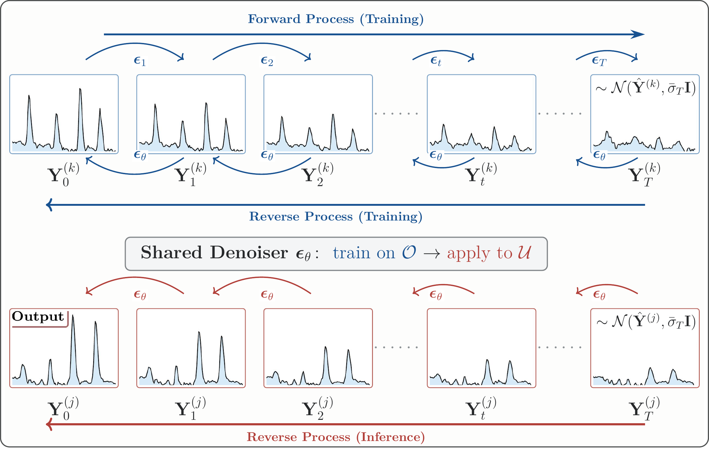

# ZeroDiff: Zero-Shot Time Series Reconstruction via Informed-Prior Diffusion

**[ICML 2026]**

Yingda Fan<sup>1</sup>, Dan Lu<sup>2</sup>, Xiaowei Jia<sup>1</sup>

<sup>1</sup>Department of Computer Science, University of Pittsburgh &nbsp;&nbsp; <sup>2</sup>Oak Ridge National Laboratory

---

Time series modeling critically depends on the availability of target observations. Yet in practice, such observations are often entirely absent for a significant portion of domains -- while exogenous variables may be accessible everywhere, target measurements remain unavailable due to cost, infrastructure, or other constraints. This creates a challenging generalization problem: can models learn from domains with complete observations to reconstruct targets for domains where they have never been observed?

We term this **zero-shot cross-domain time series reconstruction**, a task fundamentally different from conventional forecasting or imputation, as the model must infer temporal patterns for targets it has never seen during training.

**ZeroDiff** addresses this by combining (1) cross-modal moment estimation via a conditional VAE, (2) dynamics learning in a normalized space, and (3) diffusion-based calibration with an informed prior, enabling probabilistic reconstruction in a truly zero-shot setting.

## Framework

<div align="center">
    
</div>

**Diffusion-based calibration with an informed prior.** *Top (training):* at an observed location $k$, the forward process diffuses the target $\mathbf{Y}_0^{(k)}$ toward the informed prior $\mathcal{N}(\hat{\mathbf{Y}}^{(k)}, \bar{\sigma}_T \mathbf{I})$, built from the Stage-1 moment and dynamics estimates, rather than toward pure noise; the reverse process trains a denoiser $\epsilon_\theta$ to undo it. *Bottom (inference):* at an unobserved location $j$, the same shared denoiser starts from $\mathcal{N}(\hat{\mathbf{Y}}^{(j)}, \bar{\sigma}_T \mathbf{I})$ and runs the reverse process to produce the calibrated reconstruction $\mathbf{Y}_0^{(j)}$. Because the chain starts from the prior instead of noise, the model calibrates rather than generates from scratch.

ZeroDiff operates in two stages:

1. **Informed Prior Construction**: Estimate target distribution statistics (&mu;, &sigma;) from exogenous inputs via a conditional VAE, then learn shared temporal dynamics in normalized space using an LSTM. This yields a coarse but structured reconstruction at both observed and unobserved locations.

2. **Diffusion-Based Calibration**: Apply a non-stationary diffusion process that learns to correct systematic errors in the prior. The forward process starts from the informed prior (not pure noise), and a moment-guided weighting scheme focuses training on locations most relevant to the target. A bidirectional denoiser leverages full temporal context for refinement.

## Project Structure

```
ZeroDiff/
├── imputation/
│   ├── run_gx_enc.sh                 # Main entry point: K-fold cross-validation pipeline
│   ├── data_processing/
│   │   ├── preprocess_perseg_aligntime_camels.py   # Data preprocessing
│   │   ├── modify_basin_to_nan_allmask.py           # Mask target basins
│   │   ├── apply_vae.py                             # VAE moment estimation
│   │   ├── postprocess_perseg_aligntime.py          # LSTM evaluation
│   │   ├── postprocess_perseg_aligntime_raw.py      # Diffusion evaluation
│   │   └── merge_basin_metrics.py                   # Aggregate metrics
│   ├── spatial_extrapolation/
│   │   └── vae_ablation_7_res.py      # Conditional VAE for moment estimation
│   ├── lstm/
│   │   ├── base.py                    # LSTM training (dynamics learning f_omega)
│   │   ├── model.py                   # LSTM architecture
│   │   ├── fill_prepped_npz_raw.py    # Fill predictions for Stage 2
│   │   └── config.yml                 # LSTM hyperparameters
│   └── diffusion/
│       ├── configs/nsdiff.yml         # Diffusion hyperparameters
│       ├── scripts/CAMELS/
│       │   └── run_gx_enc_stage2.sh   # Stage 2 entry point
│       └── src/
│           ├── models/NsDiff.py       # Non-stationary diffusion model
│           ├── layer/
│           │   ├── mu_backbone_enc.py # Bidirectional encoder backbone
│           │   ├── g_backbone.py      # Sigma estimation backbone
│           │   ├── denoise.py         # Conditional guided denoiser
│           │   └── nsdiff_utils.py    # Diffusion sampling utilities
│           ├── nn/
│           │   ├── wave_fusion.py     # Bidirectional wave fusion modules
│           │   └── tmdm_diffusion_utils.py  # Beta schedule utilities
│           ├── experiments/
│           │   ├── diffcal_gx_enc.py  # Main diffusion experiment
│           │   └── prob_forecast.py   # Base experiment class
│           ├── datasets/              # Dataset loaders
│           ├── dataloader/            # DataLoader wrappers
│           ├── metrics/               # CRPS, PICP, QICE, ProbMAE/MSE/RMSE
│           └── utils/                 # Sigma computation, argument parsing
└── denormalized_camels_data_time.parquet  # CAMELS dataset (preprocessed)
```

## Prerequisites

- Python 3.10
- CUDA-compatible GPU

Install PyTorch (>= 2.0) with the appropriate CUDA version for your system following [https://pytorch.org](https://pytorch.org), then install the remaining dependencies:

```bash
# Example: PyTorch with CUDA 11.8
pip install torch torchvision --index-url https://download.pytorch.org/whl/cu118

# Other dependencies
pip install -r requirements.txt
```

## Data Preparation

The pipeline expects a preprocessed `.parquet` file containing CAMELS basin data with meteorological drivers, catchment attributes, and streamflow observations. The CAMELS dataset is available at [https://ral.ucar.edu/solutions/products/camels](https://ral.ucar.edu/solutions/products/camels); following common practice in deep-learning hydrology, our experiments use the widely adopted 531-basin benchmark subset. Place the preprocessed file at the repository root:

```
ZeroDiff/
└── denormalized_camels_data_time.parquet
```

**The included `.parquet` file contains a 200-basin subset for demonstration purposes.** To reproduce the results reported in the paper, replace it with the complete 531-basin benchmark subset.

The preprocessing script (`preprocess_perseg_aligntime_camels.py`) generates `prepped.npz` containing standardized training/validation/test splits.

## Usage

### Leave-One-Out Cross-Validation

We use a leave-one-location-out protocol: each fold masks one basin's target observations and trains on the rest. Folds 1--2 are reserved for hyperparameter tuning.

```bash
cd imputation

# 200-basin demo: leave-one-out (200 folds), run 100 test basins (folds 3-102)
bash run_gx_enc.sh diffcal 200 3 102

# Full dataset (531 basins): leave-one-out, run 100 test basins
# bash run_gx_enc.sh diffcal 531 3 102

# Run a single fold for quick testing
bash run_gx_enc.sh diffcal 200 3 3
```

Each fold executes a two-stage pipeline:

**Stage 1** -- Informed Prior Construction:
1. Preprocess data with per-basin standardization
2. Mask target basins (simulate zero-shot setting)
3. Estimate moments via conditional VAE
4. Train LSTM on remaining basins
5. Generate prior predictions for all basins

**Stage 2** -- Diffusion Calibration:
1. Train non-stationary diffusion model with informed prior
2. Apply moment-guided loss weighting
3. Generate calibrated predictions and evaluate

### Output

Results are saved to:
- `lstm/output/` -- LSTM predictions and metrics
- `diffusion/output/pred/` -- Diffusion predictions (.npy)
- `diffusion/output/figure/` -- Visualization figures

## Citation

If you find this work useful, please cite:

```bibtex
@inproceedings{fan2026zerodiff,
  title     = {ZeroDiff: Zero-Shot Time Series Reconstruction via Informed-Prior Diffusion},
  author    = {Fan, Yingda and Lu, Dan and Jia, Xiaowei},
  booktitle = {Proceedings of the 43rd International Conference on Machine Learning (ICML)},
  year      = {2026}
}
```

> *The bibtex will be updated with the official PMLR volume, pages, and URL once the proceedings are published.*

## References

Parts of the code architecture are based on:

- Ye, W., Xu, Z., & Gui, N. (2025). *Non-stationary Diffusion for Probabilistic Time Series Forecasting*. ICML 2025.

## Contact

For questions or feedback, please open an [issue](https://github.com/YingdaFan/ZeroDiff/issues) or contact Yingda Fan (yf474@rutgers.edu).

## License

This project is licensed under the MIT License - see the [LICENSE](LICENSE) file for details.

